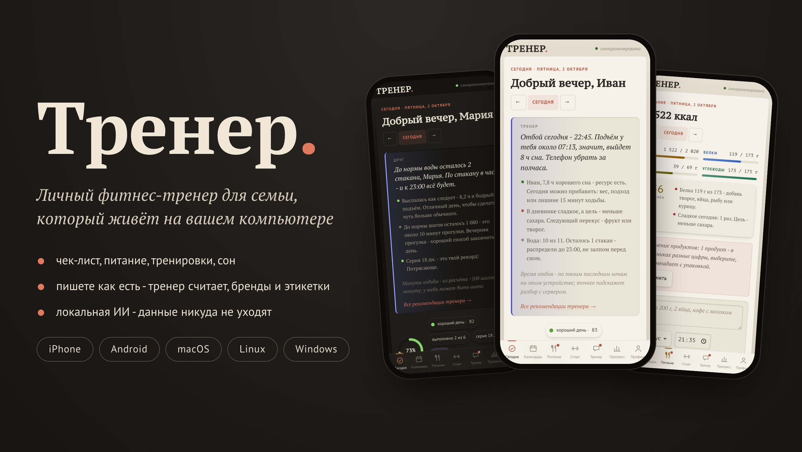
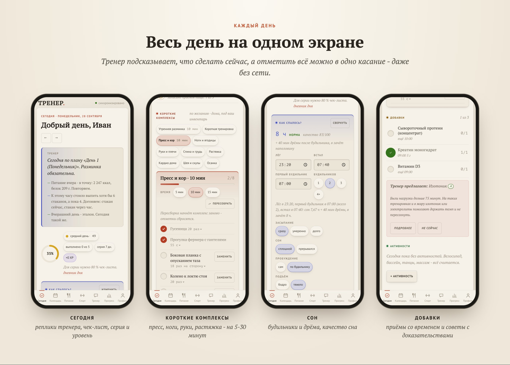
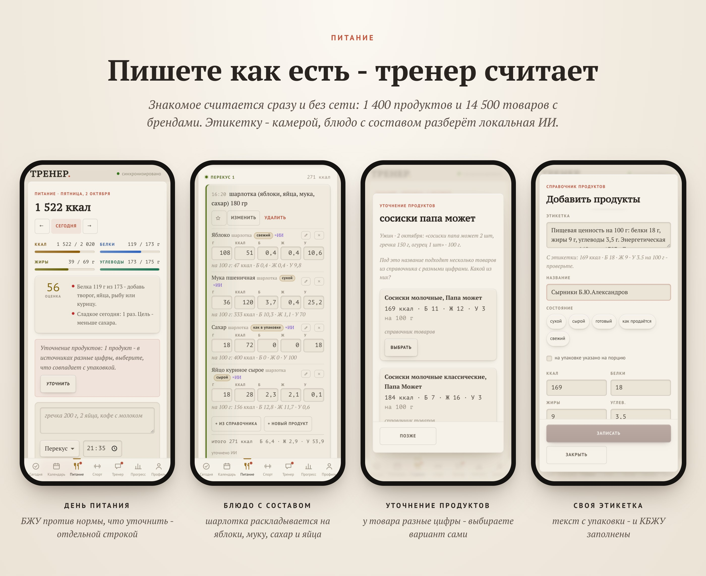
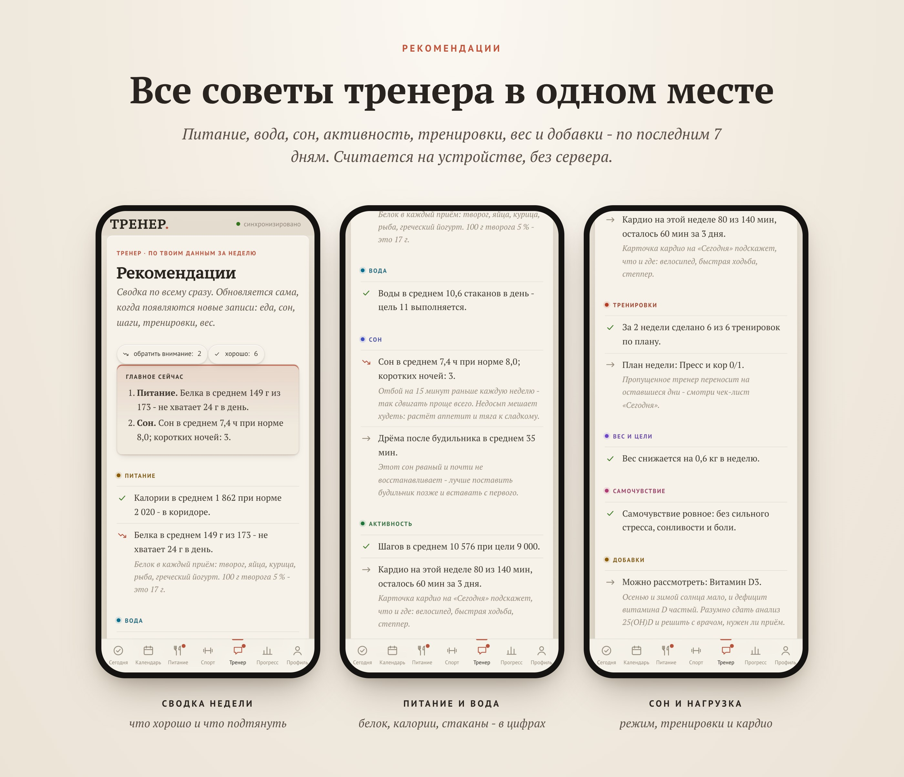
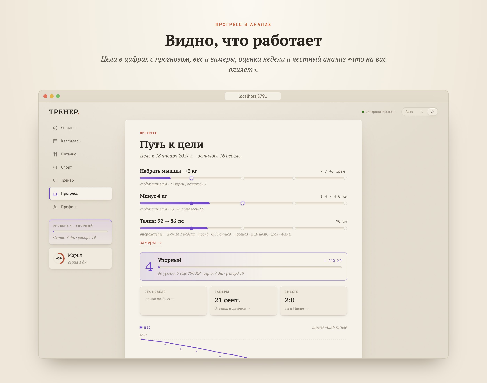
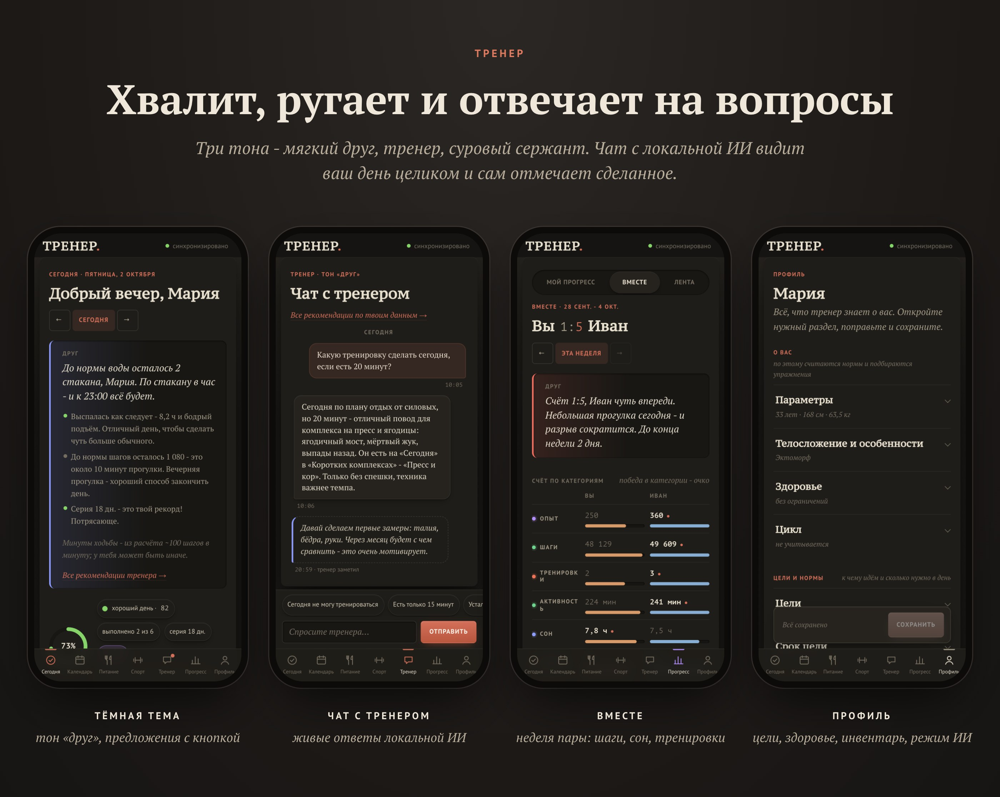
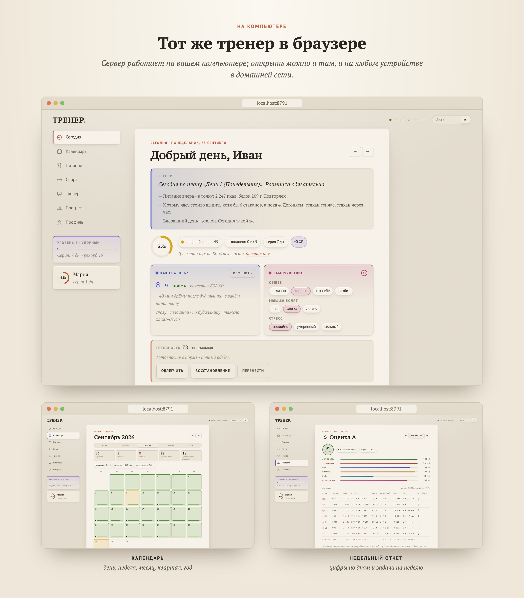

# Тренер

Личный фитнес-тренер для семьи, который живёт **на вашем компьютере**. Чек-лист дня, питание с подсчётом БЖУ,
тренировки в зале и дома, сон, вода, шаги, витамины и добавки, прогресс и мотивация. Приложение открывается
на телефоне как обычное (PWA), работает без сети и синхронизирует устройства через ваш компьютер.
Советы, разборы недели и программы тренировок пишет **локальная ИИ** (Ollama): данные никуда не уходят.

> Тренер - не врач. Нормы и советы считаются по общепринятым формулам и рекомендациям; при болезнях,
> беременности и приёме лекарств обсуждайте нагрузки, питание и добавки с врачом.

<p align="center"></p>

Скриншоты сделаны на тестовых данных: Иван (зал, набор мышц) и Мария (дом, снижение веса).

## Содержание

- [Возможности](#возможности)
- [Как это устроено](#как-это-устроено)
- [Системные требования](#системные-требования)
- [Установка](#установка)
- [Телефон и планшет](#телефон-и-планшет)
- [Обновление](#обновление)
- [Настройки, данные и резервные копии](#настройки-данные-и-резервные-копии)
- [Документация](#документация)

## Возможности

### «Сегодня»
- **Чек-лист дня**: утренняя разминка, вода (стаканы под вашу норму или цель, в день тренировки больше), шаги, тренировка по плану, питание. Свои пункты - в профиле.
- **План недели**: тренер сам раскладывает по дням то, что должно быть «n раз в неделю» - осанку, шею, ваши активности (велосипед, бассейн) и **домашние комплексы под цели** (например, «руки ×1,4» - «Руки и плечи» дважды в неделю в дни без зала). Пропущенное не пропадает: план каждый день пересчитывается и переносит его на оставшиеся дни недели.
- **Питание на «Сегодня»**: калории, белки, жиры и углеводы против нормы и сколько ещё осталось добрать.
- **Тренер**: реплики на выбранный тон - мягкий друг, тренер или суровый сержант. Хвалит и ругает за дело, помнит вчерашний день, обращается по имени и в нужном роде. Может предложить действие кнопкой, например «Добавить: короткая тренировка, 20 мин», если неделя недобрана.
- **Утренняя разминка** собирается каждый день заново под выбранное время; любимые упражнения можно закрепить.
- **Короткие комплексы на выбор**: короткая тренировка, пресс и кор, ноги и ягодицы, руки и плечи, спина и грудь, растяжка, кардио дома, шея и скулы, осанка - на 5-30 минут, под ваш домашний инвентарь.
- **Сон**: во сколько лёг и встал, засыпание, пробуждение, подъём. **Несколько будильников**: время первого и сколько их было - дрёма после будильника засчитывается наполовину, тренер советует один будильник на реальное время подъёма.
- **Самочувствие, стресс, мышцы, сонливость днём** → **готовность дня**: тренировку можно облегчить, заменить восстановлением или перенести - недельный объём сохранится.
- **Тип дня**: болезнь, отдых, особый день, читмил (тренер разрешит его, только если неделя прошла ровно).
- **Чай и кофе**: каждая чашка со временем - тренер сравнивает кофеин после 14:00 со сном.
- **Витамины и добавки**: отметки приёмов со временем и дозой.
- **Погода и кардио**: где лучше позаниматься сегодня (улица, дом, зал) с учётом погоды и сезона; сколько осталось до недельной нормы кардио.
- **Активности**: больше 100 видов - бег, велосипед, плавание, бокс, ММА, борьба, джиу-джитсу, фехтование, хоккей, теннис и падел, скалолазание, воркаут, тяжёлая атлетика, танцы, йога, горные лыжи, сёрфинг и многое другое, с калориями по MET (Compendium of Physical Activities). Сначала показываются те, что вы выбираете чаще.
- **«Для вашего спорта»**: если вы занимаетесь каким-то видом, тренер собирает комплекс в его поддержку - например, для бокса кор с ротацией, плечи и шея, для бега ягодицы и стопы, для скалолазания жимы как противовес - и предлагает его в свободный день. Программа от ИИ тоже подтягивает эти зоны.

<p align="center"></p>

### Питание
- Пишете как есть: «гречка 200 г, 2 яйца, кофе с молоком», «тарелка борща». Знакомое считается **сразу по справочнику** (≈ 1400 продуктов с порциями и ≈ 14 500 товаров из магазинов с брендами) и памяти тренера - без сети и без ИИ; новое по кнопке разбирает ИИ и запоминает.
- **Подсказки из истории**: «Часто на завтрак» и «Вы уже ели» при наборе. Нажатие - окно «Записать снова», где можно поправить граммы каждого продукта.
- Калории и БЖУ против нормы, оценка дня питания, окно питания (интервальное голодание), избранное, «как вчера».
- «Как у Марии»: если ели одно и то же, приём пищи партнёра копируется к себе одной кнопкой и дальше правится как свой. Работает, только если партнёр сам разрешил это в профиле.
- **Рацион на день** из простых продуктов под вашу норму; рецепты и уточнения - с ИИ.
- Цели-привычки: меньше сахара, мучного, кофе, алкоголя, фастфуда, поздней еды.
- Запись можно поправить по строкам: убрать лишнее, дописать продукт из справочника, изменить граммы.
- Справочник продуктов пополняется: своё блюдо, поиск в интернете: Open Food Facts и сайты-счётчики калорий с российскими брендами (можно выключить). Найденное сразу попадает в общий справочник для всех; если источники дают для товара разные цифры, приложение спрашивает, какие совпадают с упаковкой. Товары из магазинов (Савушкин, Простоквашино, ВкусВилл…) уже встроены и работают без сети; обычные продукты в поиске идут первыми, товар - если в запросе есть бренд.

### Тренировки
- **Программа на 4-8 недель** в зал или дома: локальная ИИ составляет её под цели, дни недели, время, инвентарь, уровень и ограничения по здоровью; техника каждого упражнения - из каталога (≈ 230 упражнений с описанием, ошибками, вариантами проще и сложнее).
- В тренировке: подходы, повторы, веса, отдых с таймером, подсказки прогрессии («добавь 2,5 кг»).
- **«Не предлагать»** упражнение (неудобно, нет тренажёра, больно) - уберётся из разминок, тренировок и новых программ; тренер сам замечает упражнения, которые вы постоянно пропускаете, и предлагает замену.
- **Что есть дома** и **чего нет в зале** - подбор только под доступный инвентарь.
- **Кардио**: недельная норма по целям, любимые виды и места, тренажёры в зале и дома, прогулки.
- **Разгрузочная неделя** одной кнопкой, с отменой.
- Тренировка «на любой случай» из генератора: есть 15 минут, болит колено, нет инвентаря.
- **Домашние комплексы под цели** в дни без зала: зоны берутся из целей (руки, пресс, ноги, спина); если тренировок по программе меньше нормы - тренер добирает короткими тренировками.

<p align="center"></p>

### Витамины и добавки (по желанию)
- **Справочник** из 64 позиций - протеины, креатин, аминокислоты, витамины, минералы, омега-3, изотоники, «жиросжигатели» - с **силой доказательств** (A - сильные, B - умеренные, C - слабые, D - пользы не доказано) и источниками (ISSN, EFSA, NIH, Cochrane), обычной дозой, **безопасным дневным пределом**, противопоказаниями и предупреждениями.
- **Стоп-лист** из 21 опасного или запрещённого вещества (DNP, эфедрин, кленбутерол, SARMs, стероиды и т. п.) - тренер предупредит, если ввести такое вручную.
- Отметки приёмов со временем и дозой; **протеин и спортпит идут в БЖУ дня** по фактическим граммам.
- Проверка доз против безопасного предела, противопоказаний из профиля и лекарств.
- **Советы тренера - только с доказательностью A/B и по вашим данным**: протеин при недоборе белка, креатин при силовых целях, проверка витамина D осенью и зимой, изотоник на долгих нагрузках, омега-3 при редкой рыбе, B12 при вегетарианстве. Всегда с оговоркой «обсудите с врачом».

### Рекомендации тренера
Все советы в одном месте: питание (калории, белок, углеводы и жиры против нормы, поздняя еда), вода (в том числе если ваша цель ниже расчётной), сон (норма, режим, дрёма после будильника), активность (шаги, кардио, недельный объём), тренировки (что сделано, что осталось в плане недели, пора ли разгрузка), вес и цели, самочувствие, добавки и заметные связи из анализа. Сверху - «Главное сейчас»: что поправить в первую очередь. Считается на устройстве по записям за неделю и обновляется само, как только появляются новые данные.

<p align="center"></p>

### Прогресс и анализ
- Вес и замеры (грудь, талия, живот, бёдра, руки и ноги по отдельности), графики, **цели в цифрах** с прогнозом и реалистичным сроком.
- **Оценка дня и недели**, серии, уровни, достижения, недельный отчёт с цифрами по дням.
- **«Что на вас влияет»** - локальный анализ ваших данных: сон и самочувствие, белок и вес, кофеин и алкоголь против сна, добавки для сна, шаги, читмилы. Честно помечается, где данных мало.
- **Разбор недели от ИИ** по кнопке: что получилось, что нет, задачи на следующую неделю и совет на завтра.
- Статистика сна: средние часы, качество, режим, дрёма после будильника.

<p align="center"></p>

### Календарь
День, неделя, месяц, квартал, год: выполнение, тренировки, питание, сон и заметки; дневник любого дня.

### Вместе
Партнёры видят **только итоги** друг друга: процент дня, серии, достижения. Соревнование по шагам, активности и сну - только если оба согласились. Еду, вес, замеры, сон и заметки не видит никто.

### Чат с тренером
Вопросы про питание, упражнения, самочувствие; тренер видит ваши данные и отвечает с кнопками-действиями (перенести тренировку, облегчить, записать еду). Частые ситуации - «не могу сегодня», «есть 15 минут», «болит…», «устал» - решаются быстрыми кнопками **без ИИ и без сети**.

<p align="center"></p>

### Профиль
Параметры, телосложение и особенности, цели и срок, ограничения по здоровью, травмы, диета, аллергии, лекарства, цикл (учитывается в нагрузке и весе), график и время на тренировки, активности, инвентарь, кардио, «мои упражнения», питание, напоминания, тон тренера, **режим ИИ** (включена / выключена), нормы (формулы + комментарий ИИ; **свои БЖУ** поверх расчёта - в профиле или по договорённости с тренером в чате, калории пересчитываются сами), чек-лист, тема, экспорт данных.

### «Здоровье» iPhone и Apple Watch
Команда iOS отправляет на ваш компьютер шаги, активные калории, сон, вес, пульс в покое и HRV (для готовности дня). **Готовую команду** с вашим адресом и токеном сервер на Mac собирает и подписывает сам - кнопка «Добавить команду на iPhone» в профиле; остаётся одна автоматизация «каждый день в 22:30 - запустить команду» и один раз разрешить в настройках «Быстрых команд» отправку больших объёмов данных (шаги идут отдельными замерами - так сервер убирает двойной счёт iPhone и часов). Цикл добавляется в команду вручную (шаг в инструкции). Тренировки с часов встроенными действиями «Команд» не читаются - их можно добавить через стороннее приложение (например Toolbox Pro), сервер их принимает. Инструкция - [docs/HEALTH-SHORTCUT.md](docs/HEALTH-SHORTCUT.md).

### Надёжность и офлайн
- Всё записывается на устройстве сразу и уходит на сервер при связи; правки с двух устройств сливаются, спорное приложение покажет и спросит.
- Автосохранение при вводе, отправка при сворачивании, повтор при сбоях хранилища.
- Новая версия никогда не перезагружает страницу сама - метка «обновление» в шапке.
- Запросы к ИИ, пока модель не запущена, ждут в очереди и выполняются сами (метка «ИИ спит»).
- Ежедневные резервные копии базы (14 дней).

### Виджет macOS
Для [Übersicht](https://tracesof.net/uebersicht/): включить и выключить сервер, кольцо выполнения дня, состояние локальной ИИ, «Открыть».

<p align="center"></p>

## Как это устроено

```
 iPhone / iPad / Android / браузер            ваш компьютер (macOS, Linux, Windows)
 ┌─────────────────────────────┐   Wi-Fi   ┌────────────────────────────────────────┐
 │ PWA: всё считается здесь,    │ ◀───────▶ │ сервер (Python, FastAPI, SQLite)       │
 │ работает без сети,           │  HTTPS    │ синхронизация, нормы, импорт «Здоровья»│
 │ копит правки до связи        │           │ Ollama + qwen3:30b - только локально   │
 └─────────────────────────────┘           └────────────────────────────────────────┘
```

- Чек-лист, оценки, реплики тренера, разминки и комплексы, готовность, цели, разбор еды по справочнику, анализ - **на устройстве, без сети**.
- Сервер связывает устройства, считает точные нормы, принимает данные из «Здоровья», хранит базу и резервные копии.
- Локальная ИИ пишет программы, разборы, рецепты, отвечает в чате и разбирает незнакомую еду. Сервер не запустится, если указать ИИ не на этом компьютере.
- Подробно: [docs/HOW-IT-WORKS.md](docs/HOW-IT-WORKS.md), приватность - [docs/PRIVACY.md](docs/PRIVACY.md).

## Системные требования

### Сервер (компьютер, где запускается Тренер)
- **macOS 12+** (Apple Silicon или Intel), **Linux** (x86-64 / arm64, systemd) или **Windows 10/11** (64-бит).
- Python ставить не нужно: установщик поставит [uv](https://docs.astral.sh/uv/), а он - Python 3.12.
- **git** - чтобы обновлять приложение из самого приложения (macOS: `xcode-select --install`; Windows: [git-scm.com](https://git-scm.com); Linux: пакет `git`).
- Диск: ~300 МБ приложение + **~19 ГБ модель ИИ** + данные (десятки МБ в год на человека).
- Компьютер должен быть включён, когда телефоны синхронизируются (без него всё работает на телефоне и досинхронизируется позже).

### Локальная ИИ
Используется **[Ollama](https://ollama.com)** с моделью **`qwen3:30b`** - Qwen3-30B-A3B от Alibaba: смесь экспертов (MoE),
30,5 млрд параметров, из них на каждый токен работают ~3,3 млрд, квантизация Q4_K_M, **≈ 19 ГБ**. Хорошо пишет по-русски,
умеет «думать» перед ответом и отвечать строго по JSON-схеме - на этом держатся программы, разбор еды и чат.

| Компьютер | Модель | Как работает |
|---|---|---|
| Mac Apple Silicon **от 32 ГБ** памяти (M1/M2/M3/M4 Pro, Max, Ultra), рекомендуется **48 ГБ** | `qwen3:30b` | ответ в чате 20-60 с, программа 2-4 мин |
| ПК с видеокартой NVIDIA **24 ГБ** (RTX 3090 / 4090 / 5090) и 32 ГБ ОЗУ | `qwen3:30b` | быстрее Mac |
| ПК с NVIDIA 12-16 ГБ и 32 ГБ ОЗУ | `qwen3:30b` | часть модели в ОЗУ - медленнее, но работает |
| Только процессор, **32+ ГБ** ОЗУ | `qwen3:30b` | заметно медленнее (минуты на ответ) |
| **16-24 ГБ** памяти | `qwen3:14b` (≈ 9 ГБ) | медленнее «думает», русский чуть хуже |
| **меньше 16 ГБ** | без ИИ | всё основное работает: формулы, справочники, генератор тренировок, анализ |

Установщик сам определит память и предложит подходящий вариант. Модель можно сменить в любой момент (см. [Настройки](#настройки-данные-и-резервные-копии)).
ИИ запускается **только по вашим кнопкам** (и для комментария к нормам после пересчёта); в остальное время модель выгружается из памяти через 5 минут.

### Клиенты
- **iPhone / iPad**: iOS / iPadOS 16.4+ в Safari, «На экран Домой».
- **Android**: Chrome, «Установить приложение». Автоматического импорта шагов и сна на Android пока нет (веб-приложение не может читать Health Connect) - вводятся вручную.
- **Компьютер**: любой современный браузер.

## Установка

### 1. Скачать
```bash
git clone https://github.com/insideside/health.git trainer
cd trainer
```
Через git - чтобы потом обновляться из приложения одной кнопкой. (Можно и ZIP со страницы репозитория, но тогда обновлять придётся вручную.)

### 2. Запустить установщик

**macOS / Linux**
```bash
bash install.sh
```
**Windows** - двойной клик по `install.bat` (лучше «Запуск от имени администратора»: тогда он сам откроет порт 8790 в брандмауэре для домашней сети).

Установщик по шагам:
1. ставит **uv** и Python-библиотеки приложения;
2. смотрит, сколько памяти, и выбирает модель (`qwen3:30b`, `qwen3:14b` или без ИИ - спросит);
3. ставит **Ollama** (macOS - через Homebrew или приложение с ollama.com; Linux - официальный скрипт, нужен пароль администратора; Windows - через winget) и запускает её;
4. скачивает модель (**≈ 19 ГБ**, прерванная загрузка продолжается с места);
5. проверяет, что приложение запускается;
6. создаёт ярлык: macOS - «Тренер» в Программах, Linux - в меню приложений, Windows - на рабочем столе; на macOS с Übersicht предложит виджет.

Параметры: `--model qwen3:14b` (Windows: `-Model qwen3:14b`), `--no-ai` (`-NoAi`), `--no-shortcut` (`-NoShortcut`), `--no-widget`.

<details>
<summary>Установка вручную (если установщик не подходит)</summary>

```bash
# 1. uv - https://docs.astral.sh/uv/getting-started/installation/
curl -LsSf https://astral.sh/uv/install.sh | sh           # Windows: irm https://astral.sh/uv/install.ps1 | iex
# 2. библиотеки
uv sync --frozen --no-dev
# 3. Ollama - https://ollama.com/download
brew install ollama && brew services start ollama          # macOS
curl -fsSL https://ollama.com/install.sh | sh              # Linux (сервис systemd запустится сам)
#    Windows: установщик OllamaSetup.exe с ollama.com (запускается сам, значок в трее)
# 4. модель
ollama pull qwen3:30b                                      # или qwen3:14b + строка TRAINER_MODEL=qwen3:14b в settings.env
# 5. запуск
uv run run.py
```
</details>

### 3. Первый запуск
- Запуск: ярлык «Тренер», `start.command` (macOS, двойной клик), `./start.sh` (Linux) или `start.bat` (Windows). Остановить - закрыть окно (или «Завершить» у значка в Dock).
- На этом компьютере откройте **http://localhost:8791**.
- Зарегистрируйтесь (первый аккаунт - владелец сервера), заполните профиль: пол, дату рождения, рост, вес, цели - и нажмите «Посчитать нормы».
- Второй человек регистрируется со своего устройства; всего до 4 аккаунтов.

## Телефон и планшет

Телефон и компьютер - в одной Wi-Fi-сети. Приложению в сети нужен HTTPS (иначе не работает офлайн-режим),
поэтому Тренер выпускает **свой сертификат**, и его нужно один раз поставить на телефон.

**iPhone / iPad**
1. На компьютере откройте Тренер (http://localhost:8791) → **Профиль → «Установка на iPhone»**: там QR-код и адреса вида `https://<имя-компьютера>.local:8790`. Наведите камеру iPhone на QR-код - откроется Safari (именно Safari: только он ставит профили и добавляет приложения на экран «Домой»).
2. Safari предупредит «Подключение не защищено» - это нормально, сертификат ещё не установлен: **Подробнее → посетить этот веб-сайт**.
3. На странице «Установка на iPhone» нажмите ссылку **«сертификат Тренера»** (`…/ca.crt`) → Разрешить → **Настройки → Профиль загружен → Установить**.
4. **Настройки → Основные → Об этом устройстве → Доверие сертификатам** → включите «Тренер».
5. Снова откройте адрес в Safari (теперь без предупреждений) → **Поделиться → На экран «Домой»**.

**Android**: откройте адрес в Chrome, скачайте `…/ca.crt`, **Настройки → Безопасность → Шифрование и учётные данные → Установить сертификат → Сертификат ЦС**, затем снова откройте адрес → меню → «Установить приложение».

Если телефон не видит компьютер: оба ли устройства в одной сети, не спит ли компьютер, открыт ли порт 8790 в брандмауэре (Windows, Linux). Доступ из интернета (туннель) и запасные адреса - Профиль → «Адреса сервера».

## Обновление

**Из приложения**: Профиль → **«Как это работает»** → **«Проверить обновления»** → список изменений → **«Обновить»**.
Сервер сделает `git pull`, при необходимости доустановит библиотеки и перезапустится (около минуты); если библиотеки
не встали - вернёт прежнюю версию. Обновляет владелец (первый аккаунт) или человек у самого компьютера; пока ИИ
выполняет задачу, обновление подождёт. Телефоны и планшеты поставят новую версию сами, когда в приложении ничего не вводится
(метка «обновление» в шапке). Данные (`data/`) и `settings.env` git не трогает.

**Вручную**:
```bash
git pull
uv sync --frozen --no-dev
```
и перезапустите сервер.

**С ZIP на git**: сделайте `git clone` в новую папку, перенесите в неё папку `data/` (и `settings.env`, если есть) из старой, запустите установщик.

## Настройки, данные и резервные копии

Всё хранится в папке **`data/`**: база `trainer.db` (SQLite), сертификаты, резервные копии `data/backups/` (каждый день, 14 последних).
Свои данные каждый может скачать: **Профиль → Приложение → «Скачать мои данные»**.

Необязательные настройки - файл `settings.env` рядом с `run.py` (или переменные окружения):

| Переменная | По умолчанию | Что делает |
|---|---|---|
| `TRAINER_MODEL` | `qwen3:30b` | модель Ollama (например `qwen3:14b`) |
| `TRAINER_PORT` | `8790` | HTTPS-порт для сети; HTTP для этого компьютера - на 1 больше (`TRAINER_HTTP_PORT`) |
| `TRAINER_DATA` | `./data` | папка с базой и сертификатами |
| `TRAINER_NO_WEB` | - | `1` - никаких запросов в интернет (поиск продуктов, погода) |
| `OLLAMA_URL` | `http://127.0.0.1:11434` | адрес Ollama; **только этот компьютер** - иначе сервер не запустится |

## Документация

- [HOW-IT-WORKS](docs/HOW-IT-WORKS.md) - что работает на устройстве, а что с сервером и ИИ
- [PRIVACY](docs/PRIVACY.md) - какие данные где хранятся и кто их видит
- [HEALTH-SHORTCUT](docs/HEALTH-SHORTCUT.md) - команда iOS для «Здоровья» и Apple Watch
- [ARCHITECTURE](docs/ARCHITECTURE.md), [V2-CONTRACTS](docs/V2-CONTRACTS.md) - устройство и форматы данных для разработчиков

Дизайн - «Стенограмма»: бумажный лист на тёмном столе, PT Serif / PT Sans / PT Mono, один акцент.

## Лицензия

[MIT](LICENSE)

Справочник товаров из магазинов (`app/seed/foods_store.json`) собран из базы [Open Food Facts](https://world.openfoodfacts.org) и распространяется по лицензии [ODbL 1.0](https://opendatacommons.org/licenses/odbl/1-0/), содержимое записей - [Database Contents License](https://opendatacommons.org/licenses/dbcl/1-0/). Пересборка: `scripts/build_store_foods.py`.
